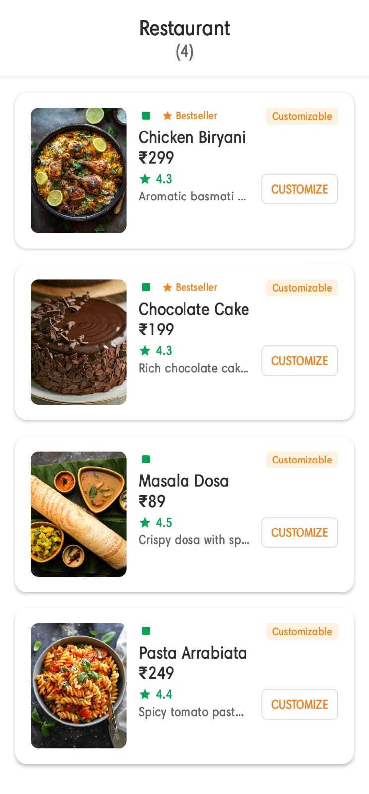
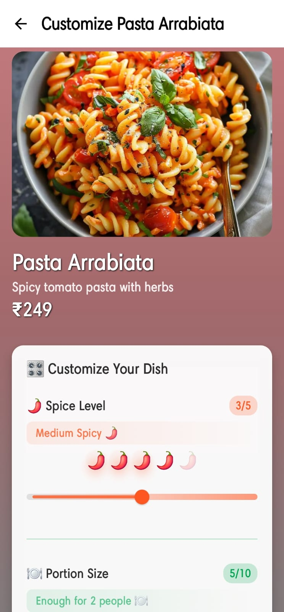
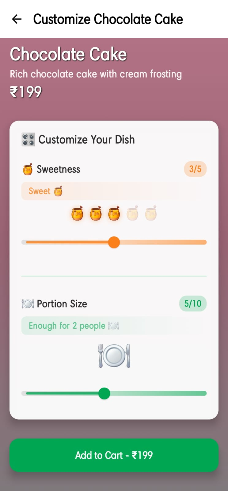

# 🍽️ Dish Customizer Demo

A modern Android application showcasing advanced Jetpack Compose animations and custom UI components for food customization experiences.

## 🎯 Project Vision

While traditional restaurant customization might seem complex, this project explores a concept perfect for **fitness-focused food delivery platforms** - imagine a dedicated section where health-conscious customers can precisely customize their meals based on nutritional preferences, portion requirements, and dietary goals.

## ✨ Key Features

### 🎨 Dynamic Visual Experience
- **Real-time Background Animations**: Color gradients that dynamically change based on customization selections
- **Responsive UI Elements**: Smooth transitions between different customization states
- **Interactive Visual Feedback**: Animated emojis and visual indicators that respond to user input

### 🎛️ Advanced Customization System
- **Multi-Parameter Sliders**: Spice level, portion size, sweetness, and saltiness controls
- **Animated Value Feedback**: Real-time visual and textual feedback with smooth animations
- **Smart Color Mapping**: UI colors adapt based on dominant customization choices

### 🎭 Animation Implementations
- **Spring Animations**: Natural bouncing effects for enhanced user engagement
- **State-Based Transitions**: Smooth animated transitions between different UI states
- **Particle-like Effects**: Pulsing buttons and scaling elements for premium feel
- **Gradient Animations**: Smooth color transitions that reflect customization intensity
## 🎥 Demo Video

📺 **[Watch Full Tutorial & Demo on YouTube](https://youtube.com/shorts/BivxzaA2PdU?feature=share)**

## 📱 Screenshots

| Dish List | Customization Interface | Dynamic Backgrounds | Features Demo |
|-----------|------------------------|-------------------|---------------|
|  |  |  |  |
| Clean, modern food listing | Interactive sliders with animations | Color-adaptive themes | Advanced UI components |

*Complete walkthrough of features, animations, and implementation details*
## 🛠️ Technical Highlights

### Advanced UI/UX Implementations

#### 🎨 **Dynamic Theming System**
- **Real-time Color Adaptation**: Background gradients that morph based on spice levels, sweetness, and saltiness
- **Contextual Visual Feedback**: UI elements change color intensity based on customization values
- **Glassmorphism Effects**: Semi-transparent cards with backdrop blur effects
- **Shadow Dynamics**: Elevation and glow effects that respond to user interactions

#### 🎭 **Animation Architecture**
```kotlin
// Multi-layered Animation System
@Composable
fun CustomizationSlider() {
    // 1. Spring Physics for Natural Movement
    val animatedValue by animateFloatAsState(
        animationSpec = spring(
            dampingRatio = Spring.DampingRatioMediumBouncy,
            stiffness = Spring.StiffnessMedium
        )
    )
    
    // 2. Infinite Transitions for Continuous Effects
    val infiniteTransition = rememberInfiniteTransition()
    val pulseScale by infiniteTransition.animateFloat(
        initialValue = 1f,
        targetValue = 1.02f,
        animationSpec = infiniteRepeatable(
            animation = tween(1000),
            repeatMode = RepeatMode.Reverse
        )
    )
    
    // 3. State-Based Visual Transformations
    val glowIntensity by animateFloatAsState(
        targetValue = currentValue / maxValue
    )
}
```

#### 🎛️ **Custom Slider Implementation**
- **Multi-Parameter Control**: Individual sliders for spice, portion, sweetness, saltiness
- **Visual Value Mapping**: Animated emojis (🌶️, 🍯, 🧂, 🍽️) that scale and fade based on values
- **Progressive Disclosure**: Labels that change dynamically ("Mild" → "Hot" → "Extra Hot")
- **Tactile Feedback**: Bounce animations and scaling effects on interaction

#### 🎪 **Interactive Elements**
- **Pulsing Buttons**: Add-to-cart button with breathing animation
- **Morphing States**: Smooth transitions between "Add to Cart" and "Added" states
- **Gesture Responsiveness**: Smooth slider dragging with momentum
- **Micro-interactions**: Hover effects, tap feedback, and loading states

### Component Architecture

#### **`CustomizationSlider`**
- **Spring-based Value Changes**: Natural physics-based transitions
- **Category-specific Styling**: Each slider type has unique colors and feedback
- **Real-time Visual Updates**: Animated progress indicators and emoji feedback
- **Accessibility Support**: Proper semantic descriptions and interaction hints

#### **`DishHeader`** 
- **Adaptive Image Presentation**: Dynamic backgrounds that complement dish colors
- **Typography Hierarchy**: Weighted text with shadow effects for readability
- **Responsive Layout**: Flexible sizing that adapts to content

#### **`DishCard`**
- **Smart Layout System**: Flexible rows with proper spacing and alignment
- **Interactive States**: Hover, pressed, and selected state animations
- **Content Optimization**: Efficient image loading and text truncation
- **Visual Hierarchy**: Strategic use of colors, spacing, and typography

#### **`CustomizationScreen`**
- **Orchestrated Animations**: Coordinated transitions between multiple UI elements
- **State Management**: Reactive updates across all components
- **Performance Optimization**: Efficient recomposition with `derivedStateOf`
- **Navigation Integration**: Smooth screen transitions with proper back handling

### UI Innovation Features
- **Gradient Morphing**: Backgrounds that shift colors based on dominant customization
- **Intensity Mapping**: Visual elements that grow/shrink with preference strength  
- **Contextual Feedback**: Smart labels that change based on combined customization values
- **Progressive Enhancement**: Animations that scale with device capabilities


## 🍎 Potential Applications

This customization system could be revolutionary for:
- **Fitness-focused meal delivery** with precise nutritional control
- **Dietary restriction management** with visual preference selection
- **Portion control solutions** for health-conscious consumers
- **Interactive cooking apps** with real-time recipe adjustments

## 🚀 Technology Stack

- **Jetpack Compose** - Modern declarative UI toolkit
- **MVVM Architecture** - Clean separation of concerns
- **Kotlin Coroutines** - Reactive state management
- **Advanced Animations** - Spring physics, state transitions, and custom easing
- **Material Design 3** - Contemporary visual design system


---

*This project demonstrates advanced Jetpack Compose capabilities through practical food-tech applications, showcasing both technical proficiency and product thinking for modern delivery platforms.*
